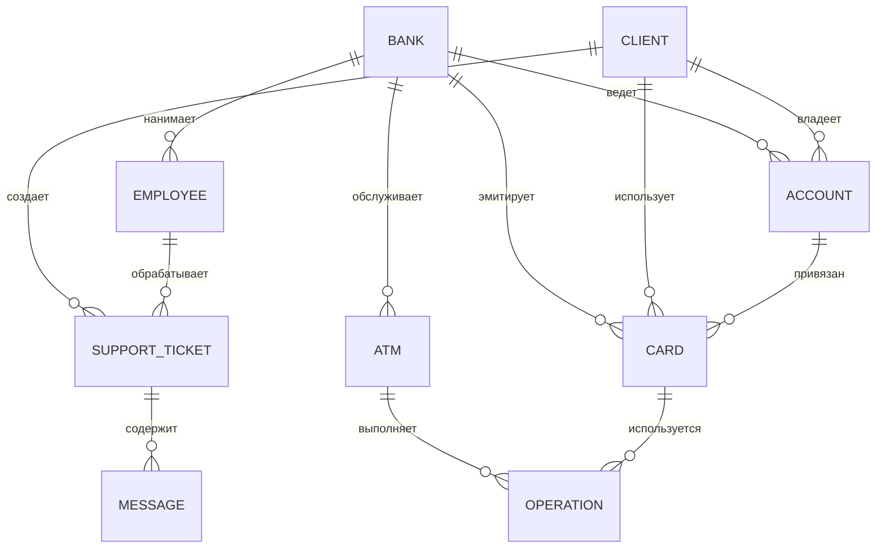

# Полная документация банковской базы данных

## 1. Сущности и таблицы

### 1.1 Банк (Bank)
| Поле | Тип | Описание |
|------|-----|----------|
| code | CHAR(5) PRIMARY KEY | Уникальный код банка |
| name | VARCHAR(100) | Название банка |
| registration_date | DATE | Дата регистрации |
| email | VARCHAR(50) | Контактный email |
| legal_address | VARCHAR(200) | Юридический адрес |
| phone | VARCHAR(20) | Контактный телефон |

### 1.2 Сотрудник (Employee)
| Поле | Тип | Описание |
|------|-----|----------|
| id | SERIAL PRIMARY KEY | Уникальный ID |
| full_name | VARCHAR(100) | Полное имя |
| login | VARCHAR(30) UNIQUE | Логин для входа |
| password | VARCHAR(128) | Хеш пароля |
| bank_code | CHAR(5) REFERENCES Bank(code) | Банк работодатель |
| position | VARCHAR(50) | Должность |
| hire_date | DATE | Дата приема на работу |

### 1.3 Клиент (Client)
| Поле | Тип | Описание |
|------|-----|----------|
| id | SERIAL PRIMARY KEY | Уникальный ID |
| full_name | VARCHAR(100) | Полное имя |
| passport | VARCHAR(30) UNIQUE | Паспортные данные |
| snils | CHAR(11) UNIQUE | Номер СНИЛС |
| email | VARCHAR(50) | Контактный email |
| login | VARCHAR(30) UNIQUE | Логин для входа |
| password | VARCHAR(128) | Хеш пароля |
| phone | VARCHAR(20) | Телефон |
| birth_date | DATE | Дата рождения |

### 1.4 Счет (Account)
| Поле | Тип | Описание |
|------|-----|----------|
| id | SERIAL PRIMARY KEY | Уникальный ID |
| account_number | VARCHAR(20) UNIQUE | Номер счета |
| type | VARCHAR(30) | Тип счета |
| open_date | DATE | Дата открытия |
| client_id | INTEGER REFERENCES Client(id) | Владелец счета |
| bank_code | CHAR(5) REFERENCES Bank(code) | Банк счета |

### 1.5 Карта (Card)
| Поле | Тип | Описание |
|------|-----|----------|
| id | SERIAL PRIMARY KEY | Уникальный ID |
| type | VARCHAR(20) | Тип карты |
| issue_date | DATE | Дата выпуска |
| expiration_date | DATE | Срок действия |
| account_id | INTEGER REFERENCES Account(id) | Привязанный счет |
| bank_code | CHAR(5) REFERENCES Bank(code) | Банк-эмитент |
| binding_status | VARCHAR(15) | Статус привязки |

### 1.6 Банкомат (ATM)
| Поле | Тип | Описание |
|------|-----|----------|
| code | VARCHAR(10) PRIMARY KEY | Уникальный код |
| address | VARCHAR(200) | Адрес установки |
| installation_date | DATE | Дата установки |
| last_service_date | DATE | Дата обслуживания |
| status | VARCHAR(20) | Текущий статус |
| bank_code | CHAR(5) REFERENCES Bank(code) | Обслуживающий банк |

### 1.7 Операция (Operation)
| Поле | Тип | Описание |
|------|-----|----------|
| id | SERIAL PRIMARY KEY | Уникальный ID |
| operation_date | DATE | Дата операции |
| operation_time | TIME | Время операции |
| type | VARCHAR(30) | Тип операции |
| amount | DECIMAL(15,2) | Сумма |
| fee | DECIMAL(15,2) | Комиссия |
| atm_code | VARCHAR(10) REFERENCES ATM(code) | Банкомат |
| card_id | INTEGER REFERENCES Card(id) | Карта |

### 1.8 Тикет поддержки (SupportTicket)
| Поле | Тип | Описание |
|------|-----|----------|
| id | SERIAL PRIMARY KEY | Уникальный ID |
| creation_date | TIMESTAMP | Дата создания |
| status | VARCHAR(20) | Статус |
| description | TEXT | Описание проблемы |
| client_id | INTEGER REFERENCES Client(id) | Автор тикета |
| employee_id | INTEGER REFERENCES Employee(id) | Ответственный |
| close_date | TIMESTAMP | Дата закрытия |

### 1.9 Сообщение (Message)
| Поле | Тип | Описание |
|------|-----|----------|
| id | SERIAL PRIMARY KEY | Уникальный ID |
| send_time | TIMESTAMP | Время отправки |
| sender_type | VARCHAR(10) | Тип отправителя |
| text | TEXT | Текст сообщения |
| status | VARCHAR(20) | Статус |
| ticket_id | INTEGER REFERENCES SupportTicket(id) | Тикет |

## 2. Связи между таблицами


# CRUD-запросы

**РА**  
```relational-algebra
Create
Добавить клиента и аккаунт
Client ← Client ∪ {
    (152, 'Иванов Иван', 'PASS123', 'SNILS-001', 'ivan@mail.com', 
    'ivanov', 'pass123', '+79990000000', '1990-01-01', 'B-001')
}
Account ← Account ∪ {
    (1001, 'ACC-001', 'savings', CURRENT_DATE, 152, 'B-001')
}


Read
Клиенты банка "B-001"
π full_name (σ bank_code='B-001'(Client))

Сотрудники с >5 тикетов
π id, full_name (
    σ count > 5 (
        γ employee_id; COUNT(id)→count (
            SupportTicket ⋈ Employee
        )
    )
)

Активные карты с балансом >100K
π Card.type, Account.balance (
    σ binding_status='active' ∧ balance>100000 (
        Card ⋈ Account ⋈ Client
    )
)

Банки без клиентов
π code(Bank) − π bank_code(Client)

Средняя комиссия по банкам
γ bank_code; AVG(fee)→avg_fee(Operation ⋈ ATM)


Update 
Обновить статус банкомата и дату обслуживания
ATM ← (ATM - σ code='ATM-045'(ATM)) ∪ 
{('ATM-045', address, installation_date, CURRENT_DATE, 'out_of_service', bank_code)}


Delete 
Удалить клиента и связанные данные
Client ← Client - σ id=152(Client)
Account ← Account - σ client_id=152(Account)
Card ← Card - σ client_id=152(Card)
```
### 1. Добавить клиента и аккаунт (2 таблицы)
**РИ**
```
Crud
Добавить клиента и аккаунт
INSERT INTO Client VALUES (
    152, 'Иванов Иван', 'PASS123', 'SNILS-001', 
    'ivan@mail.com', 'ivanov', 'pass123', 
    '+79990000000', '1990-01-01', 'B-001'
);

INSERT INTO Account VALUES (
    1001, 'ACC-001', 'savings', 
    CURRENT_DATE, 152, 'B-001'
);


Read
Клиенты банка
SELECT full_name FROM Client WHERE bank_code = 'B-001';


Сотрудники с >5 тикетов
SELECT e.id, e.full_name 
FROM Employee e
JOIN SupportTicket s ON e.id = s.employee_id
GROUP BY e.id
HAVING COUNT(s.id) > 5;


Активные карты с балансом >100K
SELECT c.type, a.balance 
FROM Card c
JOIN Account a ON c.account_id = a.id
JOIN Client cl ON a.client_id = cl.id
WHERE c.binding_status = 'active' AND a.balance > 100000;

Банки без клиентов
SELECT code FROM Bank
WHERE code NOT IN (SELECT bank_code FROM Client);


Средняя комиссия по банкам
SELECT a.bank_code, AVG(o.fee) 
FROM Operation o
JOIN ATM a ON o.atm_code = a.code
GROUP BY a.bank_code;


Update
Обновить статус банкомата и дату обслуживания
UPDATE ATM 
SET status = 'out_of_service', 
    last_service_date = CURRENT_DATE 
WHERE code = 'ATM-045';


Delete
DELETE FROM Client WHERE id = 152;
DELETE FROM Account WHERE client_id = 152;
DELETE FROM Card WHERE client_id = 152;
```